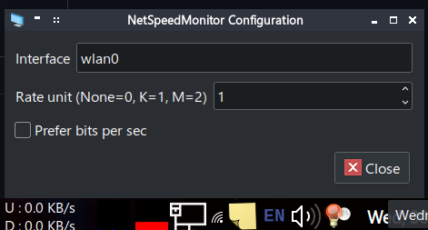

# lxNetSpeedMonitor
Show network speed by interface in lxpanel. Inspired by [NetSpeedMonitor](https://netspeedmonitor.en.softonic.com/)

  

# building and installing
Install/update build dependencies.  
Arch:  
`sudo pacman -Sy cmake base-devel`  

Debian/Ubuntu and its derivatives:  
`sudo apt install cmake build-essential lxpanel-dev`  

If you are a cool kid not using the above distros, you probably know how to install the above development packages for your distro!

Build and install with CMake:
```
# -DCMAKE_INSTALL_PREFIX is important for multiarch, especially on debian
cmake -S . -B build -DCMAKE_INSTALL_PREFIX=/usr 
cmake --build build
sudo cmake --install build
```

Restart lxpanel:  
`lxpanelctl restart`

# usage and configuration
- Right click on panel then Panel Settings
- Navigate to Panel Applets then click Add
- Double click NetSpeedMonitor or Click Add
- Right click the applet in the panel then settings
- Type in the interface you want to track usage (use `ip link` to check)
- Transmit and Receive prefix is the text prefixed before the speed. It can be freely customized including an empty string which looks more cleaner. It defaults to U for transmit and D for receive
- If using the default vertical orientation, you might have to increase your panel height in panel settings  if you can't see the entire widget (i.e. only upload is visible). A panel height of 45 works nice. Also have 0 spacing in the config
- If using the horizontal orientation, you can add some spacing to make it look better

